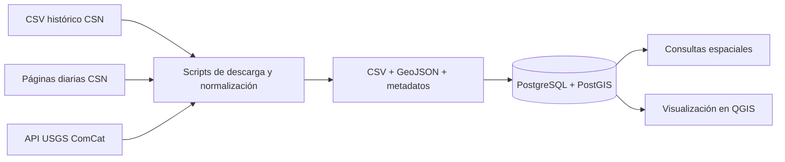

# Sistema espacial de sismicidad en Chile

Proyecto académico para descargar, normalizar, almacenar y analizar eventos sísmicos de Chile con **Python**, **PostgreSQL/PostGIS** y **QGIS**.

El sistema integra el catálogo histórico y las publicaciones diarias del Centro Sismológico Nacional (CSN), complementadas con eventos de USGS ComCat. Su objetivo es estudiar cómo se distribuyen los sismos en el espacio, el tiempo, la magnitud y la profundidad. **No es un sistema de predicción de terremotos.**

## Qué permite hacer

- Descargar y normalizar datos públicos del CSN y USGS.
- Conservar la fuente, el identificador y la magnitud original de cada evento.
- Cargar los catálogos en PostGIS sin duplicar eventos.
- Consultar sismos por fecha, magnitud, profundidad, distancia o región.
- Visualizar los epicentros en QGIS mediante geometrías `Point` en `EPSG:4326`.
- Registrar cada ejecución de carga para mantener trazabilidad.



## Estado actual

La última carga validada durante el desarrollo contiene:

| Fuente | Eventos | Cobertura del catálogo cargado |
| --- | ---: | --- |
| CSN | 57.488 | 1513-01-01 a 2026-09-22 14:40:50 UTC |
| USGS | 42 | Ventana 2026-08-01 a 2026-08-30; el último evento observado fue del 2026-08-29 |
| **Total** | **57.530** | Identificadores únicos por fuente y geometrías válidas |

Esta carga fue verificada el 2026-09-22. No es un contador en tiempo real: al volver a ejecutar los descargadores, los resultados pueden cambiar por nuevos eventos o revisiones de las fuentes. Un mismo sismo también puede aparecer una vez por fuente si fue publicado tanto por CSN como por USGS.

La base ya cuenta con:

- cinco tablas en el esquema `seismic`;
- índices temporales, de magnitud y espaciales GiST;
- carga transaccional con `UPSERT` mediante `(source_code, source_event_id)`;
- historial de cargas en `seismic.ingestion_run`;
- consultas de ejemplo con `ST_Covers`, `ST_DWithin` y `ST_ClusterDBSCAN`.

La tabla `seismic.administrative_area` está preparada, pero los límites regionales todavía no forman parte de la carga automatizada. Importarlos y asignar cada epicentro a una región es el siguiente paso del proyecto.

## Fuentes de datos

| Fuente | Uso en el proyecto | Actualidad esperada |
| --- | --- | --- |
| [Centro Sismológico Nacional](https://www.sismologia.cl/) | CSV histórico más páginas diarias oficiales | El CSV llega al 2025-06-23 y las páginas diarias completan desde el 2025-06-24 hasta el día de ejecución |
| [USGS ComCat](https://earthquake.usgs.gov/fdsnws/event/1/) | Eventos recientes dentro del rectángulo de Chile | Consulta bajo demanda; los eventos recientes pueden ser preliminares |

El uso académico de los datos del CSN debe citar al **Centro Sismológico Nacional de la Universidad de Chile** y respetar sus [condiciones de uso](https://sismologia.cl/accesos/uso-de-datos.html).

## Estructura del repositorio

```text
.
├── db/
│   ├── schema.sql                 # Modelo relacional y espacial
│   ├── apply_schema.sql           # Creación y validación de la base
│   ├── load_catalogs.sql          # Carga idempotente de CSN y USGS
│   └── queries.sql                # Consultas espaciales de ejemplo
├── scripts/
│   ├── download_csn_catalog.py
│   ├── download_usgs_earthquakes.py
│   ├── run_csn_catalog_qgis.cmd
│   ├── run_usgs_earthquakes_qgis.cmd
│   ├── start_local_postgis.ps1
│   ├── stop_local_postgis.ps1
│   └── load_catalogs_postgis.ps1
├── data/earthquakes/README.md     # Diccionario y detalles de los productos
├── .env.example                   # Configuración local sin contraseña real
├── compose.yaml                   # Alternativa con Docker
└── README.md
```

Los archivos descargados y procesados se guardan bajo `data/raw/` y `data/processed/`. Están excluidos de Git por su tamaño y por pertenecer a sus respectivas fuentes; se recrean con los scripts del repositorio.

## Requisitos

La configuración actualmente probada usa Windows con:

- Git;
- PowerShell;
- PostgreSQL 18 con PostGIS instalado;
- QGIS 3.44.13 LTR, cuyo Python se usa para las descargas HTTPS.

Los scripts de PowerShell buscan PostgreSQL en `C:\Program Files\PostgreSQL\18\bin` y los lanzadores `.cmd` buscan QGIS en `C:\Program Files\QGIS 3.44.13\bin`. Si se instalaron en otra ruta, hay que ajustar esas variables en los scripts.

Los descargadores usan solamente la biblioteca estándar de Python, por lo que también pueden ejecutarse con otro Python 3 que tenga certificados HTTPS configurados.

## Puesta en marcha

### 1. Clonar y configurar

```powershell
git clone https://github.com/G6B0/Proyecto_Base_de_datos_espaciales.git
cd Proyecto_Base_de_datos_espaciales
Copy-Item .env.example .env
```

Editar `.env` y reemplazar `cambia_esta_clave_local` por una contraseña local. El archivo `.env` está ignorado por Git y no debe compartirse.

### 2. Iniciar PostGIS

```powershell
PowerShell -ExecutionPolicy Bypass -File .\scripts\start_local_postgis.ps1
```

Este script crea un clúster aislado en `%LOCALAPPDATA%\SismosChilePostgres`, escucha solo en `127.0.0.1:5433` y no modifica otra instancia que esté usando el puerto estándar `5432`.

Como alternativa, si Docker Desktop está disponible:

```powershell
docker compose up -d
```

### 3. Descargar los catálogos

Catálogo histórico y eventos diarios del CSN:

```powershell
.\scripts\run_csn_catalog_qgis.cmd
```

La primera ejecución descarga una página oficial por día desde el
2025-06-24. Después reutiliza la caché local y vuelve a consultar solamente los
últimos siete días para recoger revisiones. El rango también puede controlarse:

```powershell
.\scripts\run_csn_catalog_qgis.cmd --recent-start 2025-06-24 --recent-end 2026-09-22 --refresh-days 7
```

Eventos USGS de los últimos 30 días:

```powershell
.\scripts\run_usgs_earthquakes_qgis.cmd
```

Para reproducir la muestra validada:

```powershell
.\scripts\run_usgs_earthquakes_qgis.cmd --start 2026-08-01 --end 2026-08-30 --min-magnitude 2.5
```

El rectángulo predeterminado es longitud `-76` a `-66` y latitud `-56` a `-17`. Incluye Chile continental, zonas oceánicas y algunos sectores limítrofes; la clasificación definitiva debe hacerse con límites administrativos en PostGIS.

### 4. Cargar los datos

```powershell
PowerShell -ExecutionPolicy Bypass -File .\scripts\load_catalogs_postgis.ps1
```

El cargador usa el CSV del CSN y el CSV de USGS más reciente. Volver a ejecutarlo actualiza los eventos existentes sin duplicarlos.

También se pueden indicar archivos concretos:

```powershell
PowerShell -ExecutionPolicy Bypass -File .\scripts\load_catalogs_postgis.ps1 `
  -CsnCsv .\data\processed\csn\csn_earthquake_catalog.csv `
  -UsgsCsv .\data\processed\usgs\usgs_earthquakes_chile_m2.5_20260801_20260830.csv
```

### 5. Consultar o visualizar

Las consultas preparadas están en [`db/queries.sql`](db/queries.sql). Por ejemplo:

```sql
SELECT
    occurred_at,
    magnitude,
    magnitude_type,
    depth_km,
    ST_Y(geom) AS latitude,
    ST_X(geom) AS longitude
FROM seismic.earthquake_event
WHERE occurred_at >= now() - interval '30 days'
ORDER BY occurred_at DESC;
```

Para conectar QGIS:

| Campo | Valor |
| --- | --- |
| Servidor | `127.0.0.1` |
| Puerto | `5433` |
| Base de datos | `sismos_chile` |
| Usuario | `sismos_app` |
| Contraseña | valor de `POSTGRES_PASSWORD` en `.env` |
| Capa principal | `seismic.earthquake_event` |
| Geometría | `geom` (`Point`, `EPSG:4326`) |

Para detener la instancia local:

```powershell
PowerShell -ExecutionPolicy Bypass -File .\scripts\stop_local_postgis.ps1
```

## Calidad y limitaciones

- Las horas se normalizan a UTC y los epicentros se almacenan en WGS 84 (`EPSG:4326`).
- La geometría es 2D; la profundidad hipocentral se conserva en `depth_km`.
- Las magnitudes deben interpretarse junto con `magnitude_type`; no todas usan la misma escala o método.
- La carga validada conserva 293 eventos sin profundidad y 15 profundidades negativas publicadas por la fuente, para permitir control de calidad sin alterar evidencia.
- El catálogo global de USGS puede omitir sismos pequeños detectados por redes locales.
- Los eventos recientes pueden cambiar de magnitud, profundidad, ubicación o estado de revisión.
- Las páginas diarias recientes del CSN se vuelven a descargar durante siete días para incorporar posibles revisiones.
- Ninguna consulta del proyecto debe interpretarse como predicción de actividad sísmica futura.

## Licencia

El código de este repositorio se distribuye bajo la [licencia MIT](LICENSE). Los datos descargados no quedan cubiertos por esa licencia: mantienen las condiciones, atribuciones y restricciones de sus fuentes originales.
